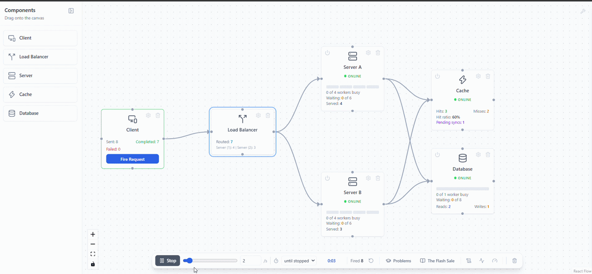

# Causality

**Stop reading about system design. Watch it happen.**

An interactive system design simulator that runs in your browser. Build a system out of clients, servers, caches, databases, and load balancers, then fire real requests through it and see what happens. Every number is measured, not faked.

🔗 **[Try it live](https://causality-lab.vercel.app/)** — no signup, no install.



---

## Why I built this

I kept reading the same sentences everywhere. Caches make reads faster. Load balancers spread traffic. Replicas can serve stale data. I nodded along, memorized it, and could repeat it in an interview.

But I'd never actually seen a cache miss turn into a database pile-up. I'd never watched a load balancer route around a server I just killed. I'd never seen a write get confirmed to a user and then quietly vanish because a queue was full.

Diagrams don't show you any of that. So I built something that does.

---

## What's different about it

Most system design tools are drawing tools with nice icons. This one actually runs.

Requests really travel. They go out, get processed, and come back, and you watch every leg of it. Servers have concurrency limits and bounded queues, so if you overload one, requests genuinely get rejected or time out — and the log tells you which, and why.

The cache tracks real keys with real TTLs. Fire the same request twice and the second one is fast for an actual reason, not because something was hardcoded to look fast. Switch the write policy and the behavior genuinely changes — including write-back, where an acknowledged write can silently disappear if the database can't keep up.

Set up a primary and a replica, write something, read it back immediately, and you'll get stale data. Because that's what really happens.

And every request carries an ID and a full hop-by-hop timeline, the same way tracing works in production. The latency numbers come from sorting actual recorded durations. No formulas, no estimates.

---

## What's in it

### Five components, each behaving like the real thing

| Component | What it models |
|---|---|
| **Client** | GET/POST mix, resource key pools, manual or continuous firing, hot-key traffic skew |
| **Server** | Concurrency limits, request queues, processing time, timeouts, kill/revive |
| **Cache** | Per-key hits and misses, TTL expiry, four write policies, lost-write tracking |
| **Database** | Read/write latency asymmetry, connection limits, queueing, primary/replica with replication lag |
| **Load Balancer** | Round-robin, least-connections, random, with health-check failover |

### Four problems to solve

Each one hands you a system that's already broken in a specific way, and a target to hit.

**Fix the Slow Product Page** *(Beginner)*
Every page view hits the database. Users say it's slow. Measure it, fix it, prove you cut the latency in half. Graded automatically.

**The Vanishing Update** *(Intermediate)*
People keep saying "I updated my profile but it still shows the old one." Support tells them to refresh twice, and that works, which is exactly why nobody's fixed it. Go find out what's really going on.

**The Viral Link** *(Intermediate)*
Your link shortener just got picked up by a celebrity. One link is eating three-quarters of your traffic, and your cache was tuned for traffic that spreads out evenly. Watch what happens the moment that one entry expires.

**The Flash Sale** *(Hard)*
Sale starts in ten minutes. Every checkout is a real order — lose one and you've lost a sale, or charged someone for nothing. Your setup has never seen sale-day traffic, and never survived a server dying mid-sale. Graded on durability and on whether it holds up when something breaks.

### Panels for digging in

The **log** gives you a full trace per request: every hop, every timestamp, whether the cache hit, whether the read was fresh, which server took it, and the exact reason if it failed.

The **health** panel shows a rolling success and failure rate. The **latency** panel gives you real p50/p95/p99 from actual samples, filterable by method or cache result.

**Dev tools** let you paste in a topology as JSON, or export just the slice of logs you care about.

### Breaking things

Kill any server, cache, or database mid-run and watch the rest of the system deal with it. Push the traffic up until queues fill and things start failing, with honest reasons attached — `queue_full`, `timeout`, `node_offline`.

Or set the cache to write-back, overload the database, and watch acknowledged writes disappear while your failure rate sits at a comfortable 0%. That one's my favorite.

---

## Getting started

```bash
git clone https://github.com/Abhisheksingh734/Causality.git
cd Causality
npm install
npm run dev
```

No backend, no database, nothing to configure. Or skip all that and [use the live version](https://causality.vercel.app).

### First two minutes

Drag a **Client** and a **Server** onto the canvas and connect them. Hit **Fire Request** and watch it go there and come back.

Add a **Database**, connect it, fire again. Heavier round trip.

Add a **Cache**, connect it, and fire twice for the same resource. The second one is much faster, and the log shows you exactly why.

Then open **Problems** and try *Fix the Slow Product Page*.

---

## Who it's for

If you're prepping for system design interviews, this is for building actual intuition instead of memorizing talking points.

If you're learning distributed systems, it's a way to see the concepts behave instead of reading about them.

If you teach this stuff, a system students can break themselves tends to land better than another slide about cache invalidation.

And if you've ever wondered what people actually mean by "cache stampede" or "read-after-write inconsistency," you can just watch one happen.

---

## Built with

React, TypeScript, Vite, React Flow, Zustand, Tailwind.

Runs entirely in your browser. No accounts, no backend, nothing leaves your machine. Diagrams save to local storage.

---

## Things you can watch happen here

Cache-aside · Write-through · Write-back · Write-around · Cache stampede · Hot key problem · TTL expiry · Read replicas · Replication lag · Eventual consistency · Read-your-writes · Read-after-write staleness · Round-robin · Least-connections · Health checks · Failover · Request queueing · Backpressure · Timeouts · Concurrency limits · p50/p95/p99 latency · Distributed tracing · Durability · Silent data loss

---

## What's next

Retry with backoff.
Rate limiting and per-client quotas. 
Comparing two designs side by side. 
And more problems, covering the classic interview questions.

---

## Contributing

Issues and PRs welcome. If something behaves oddly, export a session first (Dev Tools → Export Filtered Logs) and attach it — that file has the full trace, which makes it reproducible straight away.

---

## License

MIT
